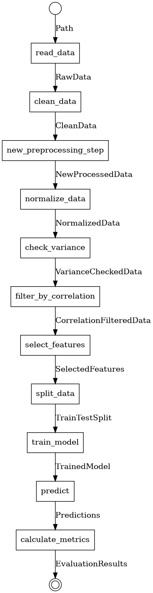

<p align="center">
  
</p>

<p align="center">
  <a href="https://www.python.org/">
    
  </a>
  <a href="https://www.apache.org/licenses/LICENSE-2.0">
    
  </a>
  <a href="https://github.com/ideos/gloe">
    
  </a>
</p>

---

## Your experiment structured, collaborative and future-proof endeavors

### Empower your machine learning research with a seamless, extensible and reproducible workflow architecture

Research Flow is a Python library designed to help researchers and practitioners in the field of machine learning and data science to structure their experiments in a modular, extensible, and reproducible manner. By leveraging the Kernel Chain architectural pattern, Research Flow provides a clear and organized way to define, execute, and visualize complex machine learning workflows.

---

## Key Features

- **Modular Design**: Break down complex experiments into manageable components,such as kernels and transformers, enhancing `readability` and `maintainability`.
- **Reproducibility Ready**: Ensure that your experiments can be easily reproduced by others, fostering `collaboration` and knowledge sharing.
- **Image Flow Visualization**: Generate visual workflows directly from your code, making it easier to understand the flow and dependencies of your experiments with seamless `documentation`.
- **Extensibility in heart**: With the Kernel Chain pattern, `easily integrate` new methodologies and data into existing experiments.
- **Strong Type Safety**: Leverage [Pydantic](https://pydantic-docs.helpmanual.io/) and [Gloe](https://github.com/ideos/gloe)'s type system to ensure that data flows correctly through your pipeline, catching potential type inconsistencies early in the development process.
- **Domain and Technology Agnostic**: The generic nature of the library allows it to be used across various domains and technologies. It is designed to be flexible and adaptable, allowing you to use it with any machine learning framework or library, such as [PyTorch](https://pytorch.org/), [TensorFlow](https://www.tensorflow.org/), [scikit-learn](https://scikit-learn.org/) or any other technology. This means you can easily integrate it into your existing projects and workflows, regardless of the tools you are using.
- **Lightweight**: Built entirely in Python, Research Flow introduces no additional dependencies, ensuring a lightweight and efficient solution.

### 📦 Installation

Requirements:

- Python 3.10 or higher

To install `Research Flow`, you can use pip:

```bash
pip install git+https://github.com/castelojb/research_flow.git 
```

## Philosophy and Motivation

With the explosion of machine learning research, the need for a structured and reproducible workflow has never been more critical. Research Flow is designed to address this challenge by providing a robust framework that enhances the organization, the code documentation and the clarity of your experiments.

Research Flow is built on the principles of the Kernel Chain pattern, which emphasizes the importance of modularity and reusability in machine learning code. This approach allows researchers to break down complex experiments into manageable components, making it easier to understand, modify, and extend their work.

---

## Architecture

Research Flow is built around the proposed Kernel Chain architectural pattern. This pattern leverages the strengths of the pipe-and-filter architecture, which is natural for the sequential steps common in ML experiments.

In the Kernel Chain pattern, an ML experiment is modeled as a chain of Kernel objects. Each Kernel represents a semantically grouped set of steps within the experiment, such as data processing, model training, or evaluation. Kernels contain attributes that are connectable components (flows or transformers) and have a defined method (`pipeline_graph` property) that specifies the main organization and execution logic of these components as a flow

The core idea is that the logic of execution is expressed directly through the arrangement and ordering of these steps within the code. Each component within a Kernel, and the Kernel itself, has well-defined input and output types

---

## 📘 Example: Conceptual ML Pipeline Using Kernel Chain

Imagine a typical machine learning research pipeline involving data loading, preprocessing, model training, and evaluation. Using **Research Flow's Kernel Chain** pattern, each major stage can be encapsulated into a modular and composable `Kernel`, enabling high-level orchestration with low-level flexibility.

### 🔧 Defining Kernels

Each `Kernel` wraps a specific phase of the pipeline, composing its internal steps using `Transformers` and a declarative `pipeline_graph` property. This allows for a clear and organized structure, making it easy to understand the flow of data and the relationships between different components.

```python
# Data Processing Kernel
class DataProcessingKernel(BaseKernel[Path, NormalizedData]):
    read_data: Transformer[Path, RawData]
    clean_data: Transformer[RawData, CleanData]
    normalize_data: Transformer[CleanData, NormalizedData]

    @property
    def pipeline_graph(self) -> Transformer[Path, NormalizedData]:
        return self.read_data >> self.clean_data >> self.normalize_data
```

```python
# Model Training Kernel
class ModelTrainingKernel(BaseKernel[NormalizedData, TrainedModel]):
    split_data: Transformer[NormalizedData, TrainTestSplit]
    train_model: Transformer[TrainTestSplit, TrainedModel]

    @property
    def pipeline_graph(self) -> Transformer[NormalizedData, TrainedModel]:
        return self.split_data >> self.train_model
```

```python
# Evaluation Kernel
class EvaluationKernel(BaseKernel[TrainedModel, EvaluationResults]):
    predict: Transformer[TrainedModel, Predictions]
    calculate_metrics: Transformer[Predictions, EvaluationResults]

    @property
    def pipeline_graph(self) -> Transformer[TrainedModel, EvaluationResults]:
        return self.predict >> self.calculate_metrics
```

### 🧪 Building and Running the Pipeline

With implementations provided for each `Transformer`, we instantiate and chain the kernels:

```python
data_processor = DataProcessingKernel(...)  # supply step transformers implementations
model_trainer = ModelTrainingKernel(...)
evaluator = EvaluationKernel(...)

# Seamless Combine the kernels into a full experiment pipeline
experiment = data_processor >> model_trainer >> evaluator

# Execute the pipeline with the input data path
results = experiment("path/to/your/data")
```

Just like that, you have a complete experiment pipeline that is easy to read, maintain, and extend. Each kernel encapsulates its own logic, and the overall structure is clear and intuitive.

---

### Extending the Pipeline

Now imagine you want to add a new preprocessing step or a different evaluation metric. With Research Flow, you can easily extend your pipeline by creating new `Transformers` or modifying existing ones without needing to overhaul the entire structure.

```python
# New Preprocessing Step
@transformer
def new_preprocessing_step(data: CleanData) -> NewProcessedData:
    # Implement your new preprocessing logic here
    pass

# Update the DataProcessingKernel to include the new step
class DataProcessingKernel(BaseKernel[Path, NormalizedData]):
    read_data: Transformer[Path, RawData]
    clean_data: Transformer[RawData, CleanData]
    new_preprocessing_step: Transformer[CleanData, NewProcessedData]
    normalize_data: Transformer[NewProcessedData, NormalizedData]

    @property
    def pipeline_graph(self) -> Transformer[Path, NormalizedData]:
        return self.read_data >> self.clean_data >> self.new_preprocessing_step >> self.normalize_data
```

Note that the new step is added to the pipeline without affecting the existing structure. This modularity allows for rapid experimentation and iteration.

### Extend the experiment

Now lets suppose you want to add a feature selection step to your experiment. Since it is a step of the experiment itself we create a new kernel responsible for it.

We start by defining the new kernel for feature selection:

```python
# Feature Selection Kernel
class FeatureSelectionKernel(BaseKernel[NormalizedData, SelectedFeatures]):
    check_variance: Transformer[NormalizedData, VarianceCheckedData]
    filter_by_correlation: Transformer[VarianceCheckedData, CorrelationFilteredData]
    select_features: Transformer[CorrelationFilteredData, SelectedFeatures]

    @property
    def pipeline_graph(self) -> Transformer[NormalizedData, SelectedFeatures]:
        return self.check_variance >> self.filter_by_correlation >> self.select_features
```

Since the reserach flow is **strongly typed** if you chain the `FeatureSelectionKernel` with the `ModelTrainingKernel` without the correct types, it will raise an error. This is a powerful feature of the library that allows you to catch errors early in the development process.  So we need to update the `ModelTrainingKernel` to accept the output of the `FeatureSelectionKernel` as input. We will also need to update the `split_data` transformer to accept the `SelectedFeatures` as input.

❗ Note: Adding new steps to the experiment is not only straightforward but also safe. Input and output types are verified at runtime, so if an incorrect type is passed to ModelTrainingKernel, an error will be raised immediately.

```python
# Model Training Kernel
class ModelTrainingKernel(BaseKernel[SelectedFeatures, TrainedModel]): # update input type
    split_data: Transformer[SelectedFeatures, TrainTestSplit] # update input type
    train_model: Transformer[TrainTestSplit, TrainedModel]

    @property
    def pipeline_graph(self) -> Transformer[SelectedFeatures, TrainedModel]:
        return self.split_data >> self.train_model
```

⚠️ Atention: remember to update the transformer implementations to accept the new input types.

Now we can use the `FeatureSelectionKernel` in our experiment pipeline:

```python
data_processor = DataProcessingKernel(...)  # supply step transformers implementations
feature_selector = FeatureSelectionKernel(...)
model_trainer = ModelTrainingKernel(...)
evaluator = EvaluationKernel(...)

# Combine the kernels into a full experiment pipeline
experiment = data_processor >> feature_selector >> model_trainer >> evaluator

# Execute the pipeline with the input data path
results = experiment("path/to/your/data")
```

See how easy it is to add a new step to the experiment? You just need to create a new kernel and add it to the pipeline.
Making it easy to add new steps to the experiment without affecting the existing structure.

### 🔄 Reproducibility and Collaboration

By using **Research Flow**, you ensure that your experiments are **reproducible** and **easy to share** with collaborators. Its **modular design** allows you to encapsulate each step of the experiment, making workflows easier to understand, modify, and extend.

Thanks to the clear **separation of concerns**, other researchers can quickly grasp your process, replicate your results, or even reuse parts of your code in their own experiments. This not only fosters collaboration but also accelerates research by making it easier to build upon and share your work.

### ✅ Benefits of This Structure

- **Modular:** Replace or reconfigure individual steps (e.g., `clean_data`, `train_model`) without impacting the rest of the pipeline.
- **Readable:** The overall experiment structure is explicit and easy to reason about.
- **Maintainable:** Clearly defined interfaces between stages promote cleaner experimentation and faster iteration.
- **Reusable:** Kernels and transformers can be reused across different experiments.
- **Extensible:** New steps can be added with minimal effort, allowing for rapid experimentation with different methodologies.

### 📊 Visual Workflow Generation

Now that you have a structured experiment pipeline, you can easily visualize the workflow using the `pipeline_graph` property. This feature allows you to generate a visual representation of your workflow, making it easier to understand and communicate your research process.

```python
[...]

data_processor = DataProcessingKernel(...)  # supply step transformers implementations
feature_selector = FeatureSelectionKernel(...)
model_trainer = ModelTrainingKernel(...)
evaluator = EvaluationKernel(...)

# Combine the kernels into a full experiment pipeline
experiment = data_processor >> feature_selector >> model_trainer >> evaluator

# Generate visual representation of the workflow
experiment.pipeline_graph.to_image("./experiment_workflow.png")
```

<p align="center">
    
</p>

This is particularly useful for documentation and presentations, as it provides a clear overview of the experiment's structure and flow.

As you can see, the visual representation clearly outlines the flow of data and the relationships between different components in your experiment.

This will create an image file (`experiment_workflow.png`) that visually represents the entire experiment pipeline.

❗ Note: The `to_image`  is a [`gloe.BaseTransformer`](https://gloe.ideos.com.br/api-reference/index.html#gloe.BaseTransformer) method, lookup their documentation for more details.

⚠️ Atention: In order to run the `to_image` method you need to have the [`graphviz`](https://graphviz.org/download/) package installed on your system and install the [`pygraphviz`](https://pygraphviz.github.io/) Python package.

<!-- ### 🔗 Documentation

For more detailed information on how to use Research Flow, including installation instructions, API references, and advanced usage examples, please refer to the Documentation -->

### 🛠️ Contributing

We welcome contributions to Research Flow! If you have ideas for new features, improvements, or bug fixes, please open an issue or submit a pull request on GitHub.

### 📜 License

This project is licensed under the Apache License 2.0. See the [LICENSE](LICENSE) file for details.
